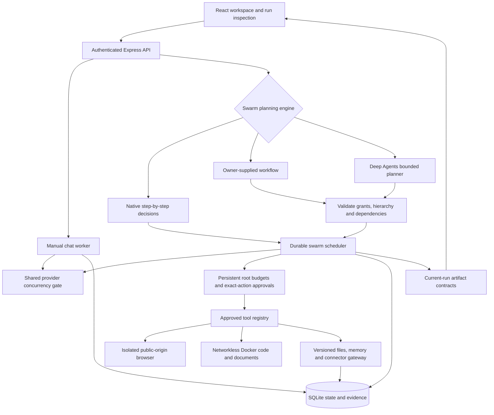

# Virtual Agents Company

**Local, single-owner AI Swarm workspace.** Create agents manually, dispatch existing team members, or let an Ollama coordinator create temporary specialists with owner-approved tools. Follow their execution, shared resource limits and durable evidence in the AI Swarm screen.

This is not an enterprise-ready autonomous organization. Host-shell execution is disabled; swarm Python and shell jobs run only in the resource-limited Docker sandbox. Successful runs complete automatically; completion does not certify factual accuracy. Dynamic and existing-team swarms are available through AI Swarm; legacy direct-subordinate delegation remains separately configurable. Earlier scripted demonstrations have been removed from the live execution paths.

## What works

- Agent creation and editing, role/personality configuration, organizational chart, projects and manually managed work items.
- Stock portraits: 20 female and 20 male options; the non-binary selection exposes all 40. Custom HTTP(S) image URLs remain available. No age, nationality, synthesis prompt, or AI portrait generation is required.
- Provider adapters for OpenAI, Anthropic, Ollama, local Hugging Face-compatible servers, and Qwen-compatible inference. Models must return the documented decision format; compatibility and quality vary by model.
- Manual chat plus a concurrent swarm scheduler with temporary agent profiles, bounded recursive delegation, isolated browser automation, shared budgets, validated decisions and durable evidence. Ollama requests across both paths share a concurrency ceiling.
- Reported token usage is separated from conservative reservations. Monetary cost remains **unknown**, rather than invented.
- Durable runs, steps/events, messages, approvals, artifacts and memories in SQLite. Interrupted active runs become blocked for explicit recovery; pending approvals survive restarts.
- Owner authentication, loopback binding, host/origin checks, server-controlled tools and endpoint allowlists.
- Automatic completion of successful runs and delegated subtasks, chat feedback, cancellation, and exact-operation approvals.

## Quick start

Requires **Node.js 24.x** and npm. Host Python is not required. Docker is required for sandboxed code and document generation; Playwright Chromium is required for browser tools and browser integration tests. Node 24's built-in SQLite module may print an experimental warning.

```sh
npm ci
cp .env.example .env
# Edit .env with the provider credentials/endpoints you actually use.
npm run dev
```

Open **http://127.0.0.1:3001**. The startup log identifies the workspace access-token file, normally `data/access-token`. Copy its contents into the sign-in form. Keep the token private. Alternatively supply `VAC_ACCESS_TOKEN` with at least 32 characters. Browser sessions use an HttpOnly, SameSite cookie and expire after 12 hours or a restart.

Production build:

```sh
npm run build
npm start
```

`npm start` explicitly enables production mode. The service remains local-only. Remote hosting, multiple users, TLS termination and tenant administration are not supported deployment modes.

## First real run

1. Configure your chosen provider (Ollama, Anthropic, OpenAI, etc.) under Settings. Save credentials before testing model discovery. LLM credentials entered in the UI last until restart; use environment variables for durable LLM credentials. Search keys have the separate persistence policy below.
2. Assign a valid model to an agent.
3. Select a project and ask for a concrete draft in chat, for example a four-line birthday poem or a short specification.
4. Open **Audit** to inspect the result and execution receipts. Model text is a draft, not proof that an external action occurred.
5. If a tool requests approval, inspect its exact arguments. Approval resumes that operation once. Successful work completes automatically; request corrections through chat.

Model discovery proves that a catalog was returned, not that inference succeeds. Provider failures, invalid decisions, missing tools, timeouts and exhausted budgets produce failed or blocked runs; there is no canned-success fallback.

## Testing with Ollama

After downloading a model and starting Ollama, keep `OLLAMA_ENDPOINT=http://127.0.0.1:11434` in `.env` (or set the actual local endpoint), then restart this application if the environment changed.

In the agent's model selector, choose **Ollama**, enter the exact installed model tag, and save. The application uses Ollama's native `/api/chat` endpoint with JSON output; the model still needs to follow the decision contract below.

Start with a short draft request, then equip `tool-calculator`, set access level 3 or 4, and explicitly ask the agent to use it for an arithmetic calculation. Inspect **Audit** for the tool call, observation and final answer before relying on it. A model appearing in discovery is not a successful inference test. Live Qwen3.5:9b validation passed controlled workflows and a smaller harness-generated report task; complex autonomous planning remains unqualified. See the validation results below.

## AI Swarm

1. Install and start Ollama, then download a suitable model. The tested local configuration is `qwen3.5:9b` on a 24 GB M4 Mac mini.
2. Configure the coordinator with that Ollama model and access level 3 or 4 in Team.
3. Open **AI Swarm**, choose a project and existing, temporary or hybrid team composition.
4. Select a planning engine, enter the objective, grant tools and set root limits. Add deliverable contracts when correctness can be checked mechanically.
5. Inspect the execution tree, approvals, artifacts and receipts. **Stop entire swarm** cancels active descendants.

Team composition and planning are separate choices:

| Choice | Behavior |
|---|---|
| Existing agents | Dispatch eligible manually created profiles |
| Temporary specialists | Create run-scoped profiles with inherited model and tool grants |
| Hybrid | Combine existing and temporary profiles |
| Native planning, default | Agents decide steps and may spawn bounded descendants during execution |
| Explicit workflow | Owner supplies workers, hierarchy, dependencies and optional ordered tool steps |
| Deep Agents, experimental | The harness generates a workflow; VAC validates and executes it |

[Deep Agents JS](https://github.com/langchain-ai/deepagentsjs) is pinned to **1.14.0**. In this integration it can record one todo list and submit/correct a workflow, with at most four actual planning calls charged to the same root budgets. It cannot independently invoke filesystem, shell, browser or subagent tools. Leave the explicit workflow plan `[]` and coordinator sequence empty when selecting it. Accepted plans become bounded VAC workers; failed plans do not create workers. Native remains the default because full-workflow autonomous qualification has not passed. See [the harness architecture](docs/HARNESS-ARCHITECTURE.md).

Default envelope: nine total agents, two concurrent workers, forty model calls, maximum delegation depth three and a thirty-minute lifetime. Server bounds cap agents, depth, calls, input/output reservations, tool/search/browser/sandbox use and elapsed time. Temporary agents do not clutter the permanent Team. More agents do not create more local compute. Swarms use Ollama only; web search can still consume paid credits.

### Swarm tools and persistent workspace

| Capability | Boundary |
|---|---|
| Project metadata and calculator | Scoped reads and deterministic arithmetic |
| Web search | Configured provider attempts and partial source evidence |
| Browser automation | Approved public origins, optional project profile, exact approval for interactive actions |
| Files and reports | Versioned project files, hashes, uploads/downloads and current-run artifact checks |
| Python and shell | Docker only, no network/host mounts, CPU/memory/PID/time/output limits |
| Document generation | Built-in CSV recipe produces JSON, DOCX, XLSX, PPTX and PDF |
| Peer collaboration | Same-root messages, dependency-aware work and retained evidence lookup |
| Memory | Provenance-bearing proposals; owner approval before future retrieval |
| Connectors | Exact allowlisted JSON-RPC tools, typed arguments, server-side credentials and approved writes |
| Skills and routines | Immutable run templates, capped dispatches, no overlap, pause controls |

Browser setup:

```sh
npx playwright install chromium
```

Build the pinned document sandbox once with Docker running:

```sh
docker build -t vac-sandbox:2026-09-21 sandbox
```

The default sandbox image matches this tag; configure `VAC_SANDBOX_IMAGE` for a separately reviewed image. There is no host-execution fallback. Routines execute only while VAC is running; this is not an always-on cloud scheduler. Saved browser state is project-scoped and does not import a personal browser or provide human login handoff. Connectors support legacy JSON-RPC and bounded MCP Streamable HTTP tool sessions; OAuth, stdio and background server-request capabilities are not enabled.

See [the swarm contract](docs/swarm-system.md) and [workspace operator guide](docs/SWARM-WORKSPACE.md) for API contracts, grants, recovery and limits.

## Web search setup

In **Settings → Web Search Providers**, enter a Tavily or Brave API key and save it. Equip the agent with **Web search** (`tool-web-search`) and set access level 3 or 4. Credentials belong to the workspace owner and are never supplied to the model.

- **Tavily Only / Brave Only:** use exactly that provider. Missing credentials or provider failure returns an explicit failed search receipt.
- **Auto:** tries configured Tavily, then Brave after a failure, then the limited DuckDuckGo lookup. Queries may be sent to multiple services; attempts and errors remain in the receipt. An empty valid response stops the search rather than triggering more paid calls.
- **DuckDuckGo Only:** encyclopedia summaries, not broad web research or live quotes.

Saved keys persist in owner-only `data/search-credentials.json` (or the configured data directory), separate from database backups. This is a private plaintext file, not encrypted storage. Saved values override `TAVILY_API_KEY` and `BRAVE_SEARCH_API_KEY`; **Remove key** saves an empty override that survives restart. Protect this file separately if credentials must be recovered. Provider selection is included in database backups. Existing database-stored search keys migrate to the private file at startup; old database pages, WAL files, or previously created backups can still contain those historical keys. Migration is not secure erasure.

**Test Connection** sends one real search request and may consume provider credits. It shares the daily Tavily/Brave allowance: `VAC_SEARCH_REQUESTS_PER_DAY=0` blocks tests before provider access. To enable them, set an approved positive limit in your private `.env` and restart VAC. A configured key is not proof of a working subscription. Search snippets are partial evidence: publication dates may be absent, Brave page dates may indicate publication or modification, and neither integration is a live market data feed. The run stores source URLs, bounded snippets, executed queries, and attempted providers. Tavily's generated answer is not treated as source evidence.

API contracts: [Tavily Search](https://docs.tavily.com/documentation/api-reference/endpoint/search), [Brave Web Search](https://api-dashboard.search.brave.com/api-reference/web/search/get).

OmniRoute is no longer a supported provider. Existing records remain as historical evidence; choose a supported provider and model for affected agents. Old queued runs cannot use the retired adapter.

## Execution contract and limits

The provider receives role instructions, scoped reviewed memory, up to 12 recent conversation messages, the current request, and the allowed tool schemas. It must return exactly one JSON decision:

```json
{"action":"final","reply":"The requested answer or draft"}
```

```json
{"action":"tool","toolId":"tool-calculator","parameters":{"operation":"add","a":19,"b":23}}
```

```json
{"action":"blocked","reason":"The information needed to proceed is missing"}
```

The manual-chat worker allows at most six model calls, caps each requested output at 2,048 tokens, limits accumulated context, and permits at most ten minutes of active execution by default. There is one active worker per workspace and at most 20 queued/working/waiting runs. Pending owner approval does not consume active execution time. Actual provider billing can differ from reported usage; this is not a guaranteed dollar-spend limit.

A successful final reply marks the run `completed` automatically. This records execution, not factual accuracy or owner acceptance. Linked manual-chat work items become Done after successful execution. Use chat feedback to request corrections. Swarms expose `partial` results when specialist work fails; no false owner-acceptance record is created.

## Manual-chat tools

| Tool | Capability | Approval |
|---|---|---|
| `tool-read-project` | Read the current project's stored metadata and artifacts | No |
| `tool-calculator` | Add, subtract, multiply or divide two finite numbers | No |
| `tool-web-search` | Tavily or Brave web snippets; optional DuckDuckGo encyclopedia lookup; partial evidence only | No |
| `tool-doc-gen` | Save supplied Markdown as a draft artifact in SQLite | Yes |

Agents must have a tool equipped and access level 3 or 4 to execute it. Levels 1 and 2 produce advisory drafts only. Levels 3 and 4 currently have the same execution policy; neither alone grants delegation or unrestricted authority. Legacy manual-chat delegation also requires `VAC_ENABLE_DELEGATION=1`, explicit `tool-delegate` permission, and an equipped direct subordinate. Imported skills are documentation assets, not enabled runtime capabilities.

There is no host-shell or host-file access. The AI Swarm workspace provides Python/shell only inside its bounded Docker sandbox, public-origin browser automation and approved connector tools. Ordinary chat does not gain those swarm-only capabilities. Unknown tools fail closed. Adding an executable tool requires implementation, schema validation, a capability review, a suitable isolation boundary, tests, and a registry version change. Clients cannot register paths or lower permissions.

## Architecture

VAC is a local, single-owner modular monolith: React, an authenticated Express API, and SQLite. Manual chat and AI Swarm have separate execution loops and share the Ollama concurrency gate.



| Module | Responsibility |
|---|---|
| `server.ts` | API composition, authentication and domain routes |
| `src/server/runs.ts` | Backward-compatible manual chat and legacy delegation |
| `src/server/swarm.ts` | Temporary profiles, recursive workers, dependency scheduling, budgets, approvals and completion gates |
| `src/server/harness.ts` | Restricted Deep Agents planner using VAC's budgeted Ollama adapter |
| `src/server/workspace.ts` | Versioned files, Docker execution, artifact contracts, reviewed memory and typed connector gateway |
| `src/server/browser.ts` | Browser isolation, origin controls, project profiles and action binding |
| `src/server/routines.ts` | Versioned skills and durable capped scheduling |
| `src/server/providers.ts` | Provider adapters, usage receipts and shared local concurrency |
| `src/server/store.ts` | SQLite persistence and transactional changes |

The browser is not a second database. Plans, workers, decisions, usage, tool receipts and artifact provenance are retained server-side. A model's completion claim cannot substitute for required tool evidence or current-run artifact contracts.

Memory retrieval enforces workspace, project/agent scope, reviewed status and expiration. Model-derived candidates require an accepted source run and remain unreviewed until owner review. Promotion creates a new version with provenance; confidence scores and tag overlap never automatically replace organization policy. Retrieved material is data, not authority to grant capabilities.

## Data migration and recovery

On first startup, an existing `data/state.json` is validated, copied to `data/state.pre-sqlite.json`, and imported transactionally. The original remains intact. Malformed data aborts migration instead of silently resetting the workspace.

Legacy work items, artifacts and project decisions are retained as **unverified legacy records**. Old unscopeable chat history is archived in the database and excluded from new conversations. Historical token/cost counters are not presented as real receipts. No seed memories or completed work items are created for a fresh workspace; default agent profiles are templates only.

The database contains private workspace information. Do not publish `data/`, backups, tokens or `.env` files. To back up a running workspace consistently:

```sh
node scripts/backup.mjs /absolute/private/path/new-backup.sqlite
```

To restore, stop the server, preserve the current data directory, and place the backup as `workspace.sqlite` in a **new private data directory**. Set `VAC_DATA_DIR` to that directory and start the server. Do not copy a database over a running connection or reuse stale WAL/SHM files. The restored database excludes environment credentials and browser sessions; sign in again. Interrupted work is blocked for review; do not resubmit uncertain operations blindly.

## Validation and maintenance

```sh
npx playwright install chromium
npm run check
npm run test:browser
# With Docker and the sandbox image available:
VAC_TEST_SANDBOX=1 npm test
npm audit
npm run skills:inventory
```

Most model decisions in the regression suite use deterministic fixtures and disposable localhost instances; browser integration exercises real Chromium. Docker tests run when `VAC_TEST_SANDBOX=1` is set. It covers authentication, the former file/script escape paths, malformed and failed inference, tool failures, bounded execution, idempotency, approval replay and restart, cancellation, interrupted-run recovery, conversation isolation, memory provenance and transaction rollback. It does not prove every live model's task quality.

The [22 September frozen pilot](docs/reviews/2026-09-22-priority-one.md) failed: one of eight reviewer cases falsely accepted an incorrect report, and both single-agent and two-specialist invoice tasks produced incorrect totals. A subsequent consistency-confirmation regression passed on the exposed failure and a correct control; it is not unseen qualification. Repeated workflow operations, execution-cost admission and two-stage review are implemented. [Deterministic source accounting](docs/reviews/2026-09-22-source-accounting.md) is now implemented for pinned, owner-provided structured invoice records, including complete row coverage, duplicate handling, typed partitions and numerical completion checks. Unstructured source interpretation, unseen qualification and demonstrated swarm advantage remain open under VAC-23, VAC-28 and VAC-42. The [parity assessment](docs/reviews/2026-09-22-swarm-parity-assessment.md) documents the wider gaps.

GitHub Actions runs types, tests, build, dependency auditing, and secret scanning. Before publication, run the secret scanner over all Git history, inspect findings, confirm third-party rights and verify one real provider run. Enabling repository visibility or hosted deployment is a separate action.

The `qs` override in `package.json` selects the patched 6.16.0 release while the Express 4 dependency chain pins an affected version. Reassess the override when upgrading Express.

## Skills and third-party assets

`claude-skills/` contains vendored documents and scripts. `npm run skills:inventory` regenerates [the inventory](docs/skill-inventory.json), including content hashes, script paths, nearest license notices, and disabled execution status. Upstream revisions and capability contracts are not fully established; the inventory is not a security or licensing certification.

Stock photos load from Unsplash and require internet access. Their [license](https://unsplash.com/license) and other applicable third-party rights remain separate. Depicted people are not employees and do not endorse the agents. See [THIRD_PARTY_NOTICES.md](THIRD_PARTY_NOTICES.md).

For the current evidence and upstream blocker, see [hardening validation](docs/reviews/hardening-validation.md).

## Current limitations and next gates

- Single-owner, local-only deployment. Workspace IDs are enforced internally; this is not a supported multi-tenant service. Tracked by VAC-29–31 and VAC-34.
- Optional independent semantic review uses a separate saved reviewer, owner-selected text/JSON evidence and a rubric; failed or inconclusive review blocks completion. Human review remains necessary for consequential decisions. VAC-28, VAC-32 and VAC-42 track qualification; no claim of general autonomous correctness.
- Swarms support existing, dynamic and hybrid teams. Specialists can spawn recursively within inherited permissions, configured depth and shared root limits. Successful execution alone does not establish business accuracy or an advantage over a single equipped agent. Tracked by VAC-23, VAC-32–33 and VAC-42.
- Arbitrary imported scripts remain disabled. The sandbox exists, but each imported tool still requires individual resource/egress and behavior validation (VAC-37).
- No automatic retry of failed or uncertain operations. Idempotency covers run submission and supported internal artifact writes. Connector intent records block equivalent uncertain writes across call IDs and worker reconstruction. [Owner-controlled recovery](docs/reviews/2026-09-22-operation-recovery.md) checks a configured authoritative remote status tool before permitting one freshly approved repeat; unsupported providers remain blocked.
- Polling and JSON records within SQLite suit a small local workspace; large datasets and distributed workers need additional design and testing (VAC-39, VAC-31 and VAC-33).
- No complete legal audit of all vendored assets (VAC-40). [VAC-41’s dated Git-history and release audit](docs/reviews/2026-09-22-secret-audit.md) found no confirmed exposure; it is not exhaustive or permanent absence certification.

## License

Copyright © 2026 Theo Chan. Original project-owned code and documentation are licensed under the [Apache License, Version 2.0](LICENSE). See [NOTICE](NOTICE) for attribution and [THIRD_PARTY_NOTICES.md](THIRD_PARTY_NOTICES.md) for third-party materials, which retain their respective licenses. Previously granted rights remain applicable.


## Release operations and verified scope

See [the release contract](docs/production-contract.md), [operating procedures](docs/operations.md), and [prioritized readiness status](upgrades.md). The current swarm evaluation uses local Ollama `qwen3.5:9b`; earlier manual-chat evidence used `qwen2.5:7b`. Tavily has separate live evaluation evidence. Brave configuration and failure handling have automated fixture coverage, but no live Brave acceptance result.

Paid cloud inference requires `VAC_ALLOW_PAID_INFERENCE=1` and operator-configured provider-side spending limits. For local models, the example configuration sets `VAC_INFERENCE_REQUESTS_PER_DAY=unlimited`: daily usage is still recorded, while per-workflow call, token, concurrency and timeout limits remain enforced. An explicit integer 0..10000 enables a daily inference cap; an omitted setting retains the fallback of 100 attempts per UTC day. Paid search defaults to zero until `VAC_SEARCH_REQUESTS_PER_DAY` is configured. These durable attempt caps include failed calls and connection tests. They are not dollar caps. Search credentials alone do not enable paid search with a zero request limit.

The **Operations** screen shows authenticated runtime readiness, build identity, worker state and request budgets. **Sign out** invalidates the current browser session. The operations guide covers all-session revocation and owner-token rotation.

`npm run release -- /absolute/new/release` prepares a runtime artifact without private data or vendored skill scripts. Run `npm ci --omit=dev` inside it. The documented launchd configuration and daily SQLite snapshot policy use a local backup folder; separately configured iCloud/Google Drive synchronization is not verified by application tests. Sync completed snapshots, not the running SQLite database/WAL.

## Validation results and remaining limits

Results recorded on 2026-09-21; fixture tests and live model quality are different evidence:

| Evaluation | Result |
|---|---|
| Backend/integration tests, including real Docker tests | 126 passed, no failures or skips |
| Browser UI tests | 17 passed, including constrained Settings layout regressions |
| Real Qwen full tool-registry workflow with an owner-supplied plan | Passed all 12 scenario checks in 376.39 seconds |
| Installed one-shot routine and nested explicit workflow | Passed |
| Fresh-input Deep Agents-generated report workflow | Passed: generated plan, specialist, current-run documents and independent calculator verification |
| Five complex Deep Agents autonomous workflow trials | Failed: invalid topology/grants and unsuccessful correction/context handling |
| Independent reviewer, fixed synthetic corpus | Revised schema: 12/12 correct decisions; initial failed corpus retained |
| Installed independent reviewer | Correct artifact accepted; incorrect artifact blocked |
| Streamable HTTP MCP interoperability | Official SDK and independent fixtures passed; public DeepWiki discovery and call passed in installed runtime |
| Harness trial with earlier reports already present | Failed; current-run contracts prevented stale files from passing as new output |

The complete scenario uses synthetic sales data and a local connector fixture. It does not prove production business-app integration. The successful smaller harness task does not establish reliable general autonomy. Failed trials remain documented in [the public validation summary](docs/reviews/2026-09-21-swarm-release.md).

On 2026-09-22, the revised bounded planner completed the complex synthetic workflow on Qwen3.5 9B: all 12 checks passed in 351.784 seconds, with one planning call and exactly one fixture connector write. [Evidence and preserved failures](docs/reviews/2026-09-22-task-planner.md). This is one development success, not a general reliability estimate.

**Grok Bot/Kimi Swarm product parity is not achieved.** Outstanding work includes complex autonomous planning, full MCP/native connectors, broad authenticated-app workflows and login handoff, broader semantic-review qualification, always-on/distributed execution, enterprise identity and measured long-horizon/large-scale reliability. See [capability research](docs/SWARM-CAPABILITY-RESEARCH.md) and the [current gap-to-work-item map and repository assessment](docs/research/2026-09-21-gap-closure.md). Static/manual agents and explicit workflows remain supported. See [the gap-closure acceptance report](docs/reviews/2026-09-21-gap-closure.md) for the exact implemented scope and retained failures.
