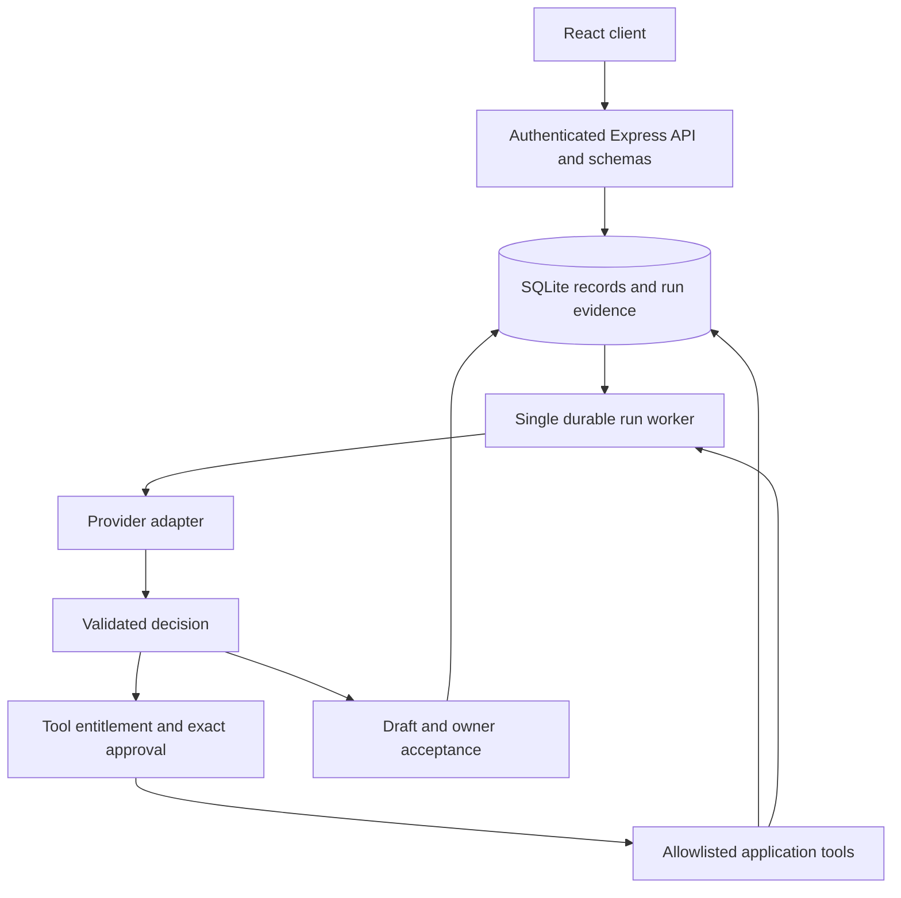

# Virtual Agents Company

**Experimental, single-owner local workspace for AI-assisted work.** Configure agent profiles, organize projects and work items, and run a bounded model/tool loop with durable execution evidence and chat feedback.

This is not an enterprise-ready autonomous organization. Arbitrary Python execution is disabled. Successful runs complete automatically; completion does not certify factual accuracy. Direct-subordinate read-only delegation is available as an explicitly enabled pilot. Earlier scripted demonstrations have been removed from the live execution paths.

## What works

- Agent creation and editing, role/personality configuration, organizational chart, projects and manually managed work items.
- Stock portraits: 20 female and 20 male options; the non-binary selection exposes all 40. Custom HTTP(S) image URLs remain available. No age, nationality, synthesis prompt, or AI portrait generation is required.
- Provider adapters for OpenAI, Anthropic, Ollama, local Hugging Face-compatible servers, and Qwen-compatible inference. Models must return the documented decision format; compatibility and quality vary by model.
- A server-side single-agent loop with validated decisions, tool observations, bounded conversation history, and recorded provider usage when reported. Cost remains **unknown**, rather than invented.
- Durable runs, steps/events, messages, approvals, artifacts and memories in SQLite. Interrupted active runs become blocked for explicit recovery; pending approvals survive restarts.
- Owner authentication, loopback binding, host/origin checks, server-controlled tools and endpoint allowlists.
- Automatic completion of successful runs and delegated subtasks, chat feedback, cancellation, and exact-operation approvals.

## Quick start

Requires **Node.js 24.x** and npm. Python is not needed for the supported runtime. Node 24's built-in SQLite module may print an experimental warning.

```sh
npm ci
cp .env.example .env
# Edit .env with the provider credentials/endpoints you actually use.
npm run dev
```

Open **http://127.0.0.1:3001**. The startup log identifies the workspace access-token file, normally `data/access-token`. Copy its contents into the sign-in form. Keep the token private. Alternatively supply `VAC_ACCESS_TOKEN` with at least 32 characters. Browser sessions use an HttpOnly, SameSite cookie and expire after 12 hours or a restart.

Production build:

```sh
npm run build
npm start
```

`npm start` explicitly enables production mode. The service remains local-only. Remote hosting, multiple users, TLS termination and tenant administration are not supported deployment modes.

## First real run

1. Configure your chosen provider (Ollama, Anthropic, OpenAI, etc.) under Settings. Save credentials before testing model discovery. LLM credentials entered in the UI last until restart; use environment variables for durable LLM credentials. Search keys have the separate persistence policy below.
2. Assign a valid model to an agent.
3. Select a project and ask for a concrete draft in chat, for example a four-line birthday poem or a short specification.
4. Open **Audit** to inspect the result and execution receipts. Model text is a draft, not proof that an external action occurred.
5. If a tool requests approval, inspect its exact arguments. Approval resumes that operation once. Successful work completes automatically; request corrections through chat.

Model discovery proves that a catalog was returned, not that inference succeeds. Provider failures, invalid decisions, missing tools, timeouts and exhausted budgets produce failed or blocked runs; there is no canned-success fallback.

## Testing with Ollama

After downloading a model and starting Ollama, keep `OLLAMA_ENDPOINT=http://127.0.0.1:11434` in `.env` (or set the actual local endpoint), then restart this application if the environment changed.

In the agent's model selector, choose **Ollama**, enter the exact installed model tag, and save. The application uses Ollama's native `/api/chat` endpoint with JSON output; the model still needs to follow the decision contract below.

Start with a short draft request, then equip `tool-calculator`, set access level 3 or 4, and explicitly ask the agent to use it for an arithmetic calculation. Inspect **Audit** for the tool call, observation and final answer before relying on it. A model appearing in discovery is not a successful inference test. Live Ollama quality validation remains outstanding.

## Web search setup

In **Settings → Web Search Providers**, enter a Tavily or Brave API key and save it. Equip the agent with **Web search** (`tool-web-search`) and set access level 3 or 4. Credentials belong to the workspace owner and are never supplied to the model.

- **Tavily Only / Brave Only:** use exactly that provider. Missing credentials or provider failure returns an explicit failed search receipt.
- **Auto:** tries configured Tavily, then Brave after a failure, then the limited DuckDuckGo lookup. Queries may be sent to multiple services; attempts and errors remain in the receipt. An empty valid response stops the search rather than triggering more paid calls.
- **DuckDuckGo Only:** encyclopedia summaries, not broad web research or live quotes.

Saved keys persist in owner-only `data/search-credentials.json` (or the configured data directory), separate from database backups. This is a private plaintext file, not encrypted storage. Saved values override `TAVILY_API_KEY` and `BRAVE_SEARCH_API_KEY`; **Remove key** saves an empty override that survives restart. Protect this file separately if credentials must be recovered. Provider selection is included in database backups. Existing database-stored search keys migrate to the private file at startup; old database pages, WAL files, or previously created backups can still contain those historical keys. Migration is not secure erasure.

**Test Connection** sends one real search request and may consume provider credits. A configured key is not proof of a working subscription. Search snippets are partial evidence: publication dates may be absent, Brave page dates may indicate publication or modification, and neither integration is a live market data feed. The run stores source URLs, bounded snippets, executed queries, and attempted providers. Tavily's generated answer is not treated as source evidence.

API contracts: [Tavily Search](https://docs.tavily.com/documentation/api-reference/endpoint/search), [Brave Web Search](https://api-dashboard.search.brave.com/api-reference/web/search/get).

OmniRoute is no longer a supported provider. Existing records remain as historical evidence; choose a supported provider and model for affected agents. Old queued runs cannot use the retired adapter.

## Execution contract and limits

The provider receives role instructions, scoped reviewed memory, up to 12 recent conversation messages, the current request, and the allowed tool schemas. It must return exactly one JSON decision:

```json
{"action":"final","reply":"The requested answer or draft"}
```

```json
{"action":"tool","toolId":"tool-calculator","parameters":{"operation":"add","a":19,"b":23}}
```

```json
{"action":"blocked","reason":"The information needed to proceed is missing"}
```

The worker allows at most six model calls, caps each requested output at 2,048 tokens, limits accumulated context, and permits at most ten minutes of active execution by default. There is one active worker per workspace and at most 20 queued/working/waiting runs. Pending owner approval does not consume active execution time. Actual provider billing can differ from reported usage; this is not a guaranteed dollar-spend limit.

A final reply puts the run in `reviewing`. Only owner acceptance marks it `completed`. This is a human acceptance gate, not an automated guarantee of factual accuracy. A linked work item becomes Done only after that acceptance; manual board changes are recorded as owner changes.

## Supported tools

| Tool | Capability | Approval |
|---|---|---|
| `tool-read-project` | Read the current project's stored metadata and artifacts | No |
| `tool-calculator` | Add, subtract, multiply or divide two finite numbers | No |
| `tool-web-search` | Tavily or Brave web snippets; optional DuckDuckGo encyclopedia lookup; partial evidence only | No |
| `tool-doc-gen` | Save supplied Markdown as a draft artifact in SQLite | Yes |

Agents must have a tool equipped and access level 3 or 4 to execute it. Levels 1 and 2 produce advisory drafts only. Levels 3 and 4 currently have the same execution policy; neither alone grants delegation or unrestricted authority. Delegation also requires `VAC_ENABLE_DELEGATION=1`, explicit `tool-delegate` permission, and an equipped direct subordinate. Imported skills are documentation assets, not enabled runtime capabilities.

There is no shell, host-file reader, arbitrary Python runner, email sender, deployment tool, or general URL-fetch tool. Unknown tools fail closed. Adding an executable tool requires implementation, schema validation, a capability review, a suitable isolation boundary, tests, and a registry version change. Clients cannot register paths or lower permissions.

## Architecture



The backend remains a modular monolith. Runtime modules are in `src/server/`: `security.ts`, `store.ts`, `providers.ts`, `tools.ts`, and `runs.ts`. `server.ts` provides API composition and domain CRUD. The UI uses server state; browser storage is not a second database.

Memory retrieval enforces workspace, project/agent scope, reviewed status and expiration. Model-derived candidates require an accepted source run and remain unreviewed until owner review. Promotion creates a new version with provenance; confidence scores and tag overlap never automatically replace organization policy. Retrieved material is data, not authority to grant capabilities.

## Data migration and recovery

On first startup, an existing `data/state.json` is validated, copied to `data/state.pre-sqlite.json`, and imported transactionally. The original remains intact. Malformed data aborts migration instead of silently resetting the workspace.

Legacy work items, artifacts and project decisions are retained as **unverified legacy records**. Old unscopeable chat history is archived in the database and excluded from new conversations. Historical token/cost counters are not presented as real receipts. No seed memories or completed work items are created for a fresh workspace; default agent profiles are templates only.

The database contains private workspace information. Do not publish `data/`, backups, tokens or `.env` files. To back up a running workspace consistently:

```sh
node scripts/backup.mjs /absolute/private/path/new-backup.sqlite
```

To restore, stop the server, preserve the current data directory, and place the backup as `workspace.sqlite` in a **new private data directory**. Set `VAC_DATA_DIR` to that directory and start the server. Do not copy a database over a running connection or reuse stale WAL/SHM files. The restored database excludes environment credentials and browser sessions; sign in again. Interrupted work is blocked for review; do not resubmit uncertain operations blindly.

## Validation and maintenance

```sh
npm run check
npm audit
npm run skills:inventory
```

The regression suite uses disposable localhost instances and a deterministic provider fixture. It covers authentication, the former file/script escape paths, malformed and failed inference, tool failures, bounded execution, idempotency, approval replay and restart, cancellation, interrupted-run recovery, conversation isolation, memory provenance and transaction rollback. It does not prove every live model's task quality.

GitHub Actions runs types, tests, build, dependency auditing, and secret scanning. Before publication, run the secret scanner over all Git history, inspect findings, confirm third-party rights and verify one real provider run. Enabling repository visibility or hosted deployment is a separate action.

The `qs` override in `package.json` selects the patched 6.16.0 release while the Express 4 dependency chain pins an affected version. Reassess the override when upgrading Express.

## Skills and third-party assets

`claude-skills/` contains vendored documents and scripts. `npm run skills:inventory` regenerates [the inventory](docs/skill-inventory.json), including content hashes, script paths, nearest license notices, and disabled execution status. Upstream revisions and capability contracts are not fully established; the inventory is not a security or licensing certification.

Stock photos load from Unsplash and require internet access. Their [license](https://unsplash.com/license) and other applicable third-party rights remain separate. Depicted people are not employees and do not endorse the agents. See [THIRD_PARTY_NOTICES.md](THIRD_PARTY_NOTICES.md).

For the current evidence and upstream blocker, see [hardening validation](docs/reviews/hardening-validation.md).

## Current limitations and next gates

- Single-owner, local-only deployment. Workspace IDs are enforced internally; this is not a supported multi-tenant service.
- Human evaluation of generated drafts. No claim of autonomous correctness or independently validated business decisions.
- Read-only delegation remains an opt-in pilot. Broad rollout requires demonstrated value over a single equipped agent; successful execution alone does not establish business accuracy.
- No imported script execution until sandboxing, resource/egress controls and individual tool validation exist.
- No automatic retry of failed or uncertain operations. Idempotency is provided for run submission and supported internal artifact writes.
- Polling and JSON records within SQLite suit a small local workspace; large datasets and distributed workers need additional design and testing.
- No complete legal audit of all vendored assets, or certification that public Git history contains no secrets.

## License

Copyright © 2026 Theo Chan. Original project-owned code and documentation are licensed under the [Apache License, Version 2.0](LICENSE). See [NOTICE](NOTICE) for attribution and [THIRD_PARTY_NOTICES.md](THIRD_PARTY_NOTICES.md) for third-party materials, which retain their respective licenses. Previously granted rights remain applicable.


## Release operations and verified scope

See [the release contract](docs/production-contract.md), [operating procedures](docs/operations.md), and [prioritized readiness status](upgrades.md). The verified candidate targets a local single-owner draft workspace using Ollama `qwen2.5:7b`; Tavily has live evaluation evidence. Brave configuration and failure handling have automated fixture coverage, but no live Brave acceptance result.

Paid cloud inference requires `VAC_ALLOW_PAID_INFERENCE=1` and operator-configured provider-side spending limits. Inference defaults to 100 attempted requests per UTC day; paid search defaults to zero until `VAC_SEARCH_REQUESTS_PER_DAY` is configured. These durable attempt caps include failed calls and connection tests. They are not dollar caps. Search credentials alone do not enable paid search with a zero request limit.

The **Operations** screen shows authenticated runtime readiness, build identity, worker state and request budgets. **Sign out** invalidates the current browser session. The operations guide covers all-session revocation and owner-token rotation.

`npm run release -- /absolute/new/release` prepares a runtime artifact without private data or vendored skill scripts. Run `npm ci --omit=dev` inside it. The documented launchd configuration and daily SQLite snapshot policy use a local backup folder; separately configured iCloud/Google Drive synchronization is not verified by application tests. Sync completed snapshots, not the running SQLite database/WAL.
