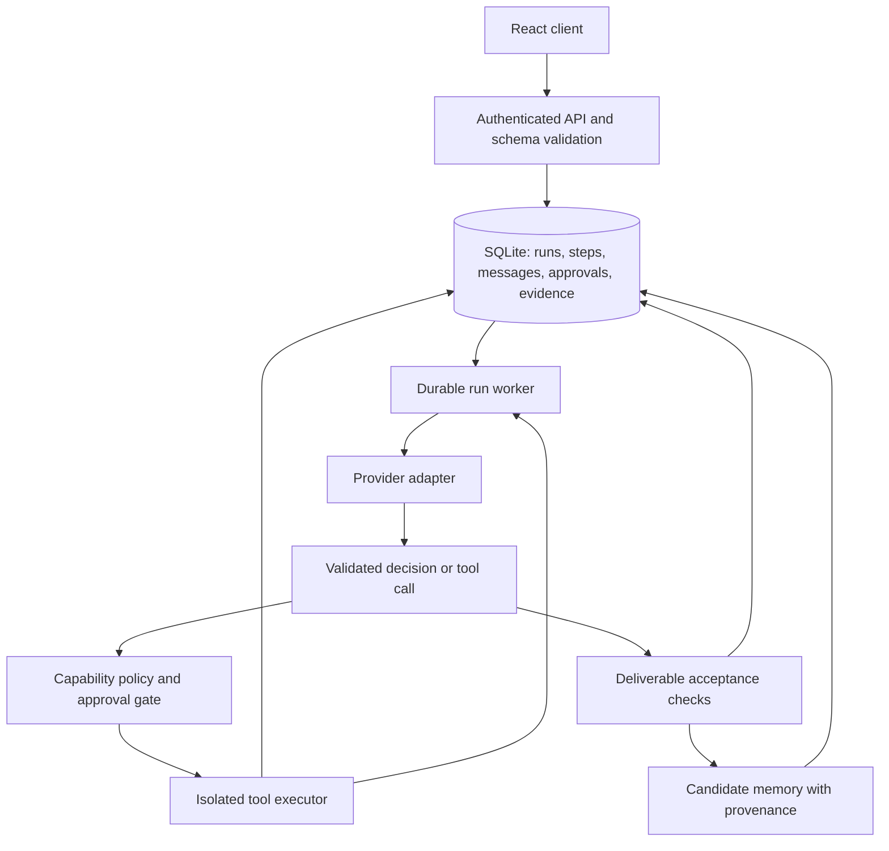

# Architecture and publication readiness review

Reviewed: 2026-09-05. Source: `51a19c38eeed5f755e69ff79da26b25dc90ac33b`.

## Verdict

The README describes an enterprise-grade autonomous organization. The implementation is a prototype combining a working interface and some real provider/tool integrations with scripted demonstrations. Several paths report completed work without evidence of execution. Security and persistence do not yet support the advertised autonomy.

Do not release this as a production-ready autonomous platform. Publishing source is distinct from exposing a running service: a public repository alone does not expose the local API. However, the default service listens on all interfaces, so reachable machines can access its unprotected APIs. A public demonstration should explicitly identify simulated behavior and disable host tool execution by default.

This review covered the README, application/backend architecture, provider routing, orchestration, memory, tools/approvals, persistence, frontend synchronization, packaging, licensing notices, and targeted behavioral probes. It was not an exhaustive security audit of every imported skill or a production load test. No fixes, commits, pushes, or changes to the running workspace service were made during this review.

## Highest-priority findings

### 1. Unauthenticated callers can read files and run existing Python scripts

**Release blocker.** `server.ts:2841` accepts caller-defined tool registrations, including paths and permission flags. `server.ts:2860` executes tools without establishing an authenticated user, a valid agent, or the agent's entitlement to that tool. `server.ts:3024` constructs filesystem paths from those registrations without containment checks. The Python subprocess inherits the host environment and runs with the application's filesystem access. The documentation fallback reads files at `server.ts:3085`. The server binds to `0.0.0.0` at `server.ts:3488`.

In a disposable instance, an unauthenticated request read a harmless marker outside the instance's workspace and executed an existing harmless Python script outside that workspace. A nonexistent agent ID was accepted. This establishes accessible-file disclosure and execution of existing Python scripts; the probe did not test arbitrary code upload.

**Repair:** Default to loopback; require authenticated access before exposing APIs; authorize every mutation and tool invocation. Keep executable paths and permissions in a server-owned registry. Resolve real paths and enforce containment, including symlinks. Execute approved tools in an isolated worker with explicit environment variables, resource limits, and controlled filesystem/network access. Validate provider endpoint destinations before forwarding stored credentials. Prompt instructions and an agent's displayed autonomy level cannot enforce these boundaries. This follows the least-privilege and tool-control principles in [OWASP's agent security guidance](https://cheatsheetseries.owasp.org/cheatsheets/AI_Agent_Security_Cheat_Sheet.html).

**Acceptance:** Unauthenticated calls fail; unknown or unequipped agents cannot execute; path escapes and symlinks outside the allowed root fail; workers cannot read application secrets.

### 2. Failure is routinely converted into apparent success

**Release blocker.** `getGenAI()` returns `null` at `server.ts:21`, so the native cloud branch cannot execute as written. The local/OpenAI-compatible gateway paths do make real requests; this finding does not mean OmniRoute is entirely disconnected.

When no provider response is available, `server.ts:2623` supplies canned completion statements and generates closed work items. Usage accounting at `server.ts:2774` increments fixed token and cost values. A web-search fallback claims verified research despite failed retrieval. The Python runner logs subprocess errors but returns `status: executed` regardless (`server.ts:3055`). A harmless script that exited with code 7 and no output returned “Execution completed successfully.”

**Repair:** Introduce explicit `succeeded`, `failed`, `blocked`, and `cancelled` outcomes. Preserve exit code, timeout, provider error, and evidence references. Show unavailable usage as unknown; record actual provider usage when supplied. Never infer execution from generated prose. Keep demo fixtures behind an unmistakable demo mode, with separate data.

**Acceptance:** Missing keys, provider outages, malformed responses, nonzero exits, and timeouts never create successful work items or invented metrics.

### 3. Collaborative orchestration is a fixed scenario

**Release blocker for the autonomy claim.** `src/lib/orchestration/orchestrator.ts:174` contains fixed specialist assignments for a Firebase-to-PostgreSQL migration. Subsequent artifacts, confidence scores, recommendations, and memory promotions are scripted. Declared depth/iteration/agent limits near line 31 are not enforced by a general execution loop. Other backend delegation paths also simulate progress with delays and fixed content.

A direct in-memory probe requested: “Write a four-line birthday poem. Do not discuss databases or migrations.” The orchestrator returned `completed`, four PostgreSQL migration artifacts, and two promoted memories. Only its delay function was bypassed to accelerate the probe; planning and output logic were unchanged.

**Repair:** Move scenario content into demo fixtures. Implement one genuine model → validated tool call → observation → next decision loop first. Completion must depend on the requested deliverable and explicit acceptance criteria. Add delegation only after measuring a benefit over that baseline.

**Acceptance:** Unrelated tasks yield relevant outputs or an honest unsupported/blocked result. Runtime limits stop actual execution. Memory promotion requires evidence from the actual run.

### 4. Persistence omits essential state; routine edits reset orchestration

**Release blocker for persistent work.** `server.ts:55` saves only projects, work items, artifacts, agents, and chat messages. Memories, registered tools, approvals, task execution state, and orchestration events are omitted. Agent creation and updates replace the orchestrator instance (`server.ts:218`, `server.ts:270`), losing its internal task/event maps. Background work depends on in-process callbacks rather than durable jobs.

A disposable restart test created a memory and tool, triggered a normal state save, then restarted the instance. Neither survived. Writes replace one JSON file without a transaction, and persistence failures are logged without necessarily failing the API operation.

**Repair:** Use SQLite with migrations and transactions for this deployment scale. Persist runs, steps, tool calls, approvals, messages, memory versions, and artifacts. A worker should claim durable jobs with leases and idempotency keys. Updating agent configuration must not reconstruct the run engine. Add backup and restore procedures.

**Acceptance:** Restart during a pending approval or active task preserves state. Recovery does not duplicate a side effect. A failed write does not acknowledge durable success.

### 5. Approval records do not authorize or resume execution

**Release blocker for sensitive tools.** `server.ts:2867` always creates a new pending approval for restricted tools. `server.ts:3197` changes a record's status but does not resume a suspended operation or provide a consumable authorization. In the probe, approving and retrying produced another `202 approval_required`. Caller-controlled tool permissions also undermine the gate.

**Repair:** Bind an approval to the authenticated approver, run, tool version, exact arguments hash, and expiry. Approval resumes that exact suspended step once. Rejection terminates or blocks it. Changes to arguments require a new decision; clients cannot lower tool permissions.

**Acceptance:** Approved work executes once; altered/replayed/rejected requests cannot execute.

### 6. Memory scopes are labels rather than a complete isolation boundary

**Release blocker before multi-user use.** Retrieval in `src/lib/memory/memoryManager.ts:85` filters project and agent scopes but does not enforce `query.workspaceId`. Organization memories cross that boundary. An in-memory probe retrieved another workspace's organization memory. The REST memory writer (`server.ts:458`) omits provenance expected by promotion; creating a memory through that route and promoting it returned HTTP 500. Conflict detection can supersede policies without matching workspace/agent ownership, and trust depends partly on caller-supplied importance/confidence.

**Repair:** Derive workspace identity from the authenticated session and enforce it in storage queries. Validate every memory writer against one schema. Keep source/run references and immutable versions. Distinguish candidate memories from reviewed facts and authorized policies. A model-generated confidence score must not authorize organization-wide policy changes. Retrieved documents and skill text remain untrusted input, not permission grants.

**Acceptance:** Cross-workspace retrieval and modification fail; every creation path can safely undergo its supported lifecycle; untrusted output cannot replace trusted policy automatically.

## Additional improvements

1. **Conversation continuity:** The OmniRoute request at `server.ts:2438` sends the compiled system context and current user message, without recent conversation turns. Stored messages are keyed by agent rather than conversation/project. Introduce conversation IDs, scoped history, bounded context, and durable summaries. Test follow-up references and switching projects.
2. **Provider contracts:** Separate adapters for inference, model discovery, structured outputs, tool calls, usage, cancellation, and errors. A successful model-list request is not an inference readiness test. A local gateway URL does not establish that inference or data stays local. Display provider provenance accurately.
3. **Frontend consistency:** `src/App.tsx` combines browser storage, server state, seed fixtures, optimistic updates, and polling. Some mutations do not check HTTP success; empty agent responses can leave stale UI. Make the server authoritative, use explicit pending/error states and rollback, and isolate demo data. Event streaming can follow after correctness.
4. **Modularity:** Split the roughly 3,500-line backend by domain: API/authentication, providers, runs, tools/policy, memory, persistence, and artifacts. Retain a modular monolith and one worker initially. Microservices would add operational burden without solving the present defects.
5. **Packaging and quality gates:** There is no automated test script or tracked CI workflow. `npm start` does not set production mode even though server behavior depends on it. Validate runtime inputs with schemas, document production startup, and add CI for types, build, integration tests, and dependency/secret scans. The dependency audit found three moderate findings in the Express/body-parser/qs chain, with fixes available; no high/critical findings in that audit.
6. **Skill supply chain:** A count of hundreds of skill documents is not a count of reliable executable capabilities. Maintain a manifest containing origin, revision, license, executable entry point, input/output schema, required capabilities, and validation status. Enable a small tested set by default. Methodology text should be presented as guidance loaded, not a successfully executed tool.
7. **Artifact and run evidence:** Store content version/hash, producing run/step, tool/provider receipts, validation outcome, and creation time. Distinguish a draft recommendation from an applied change. Show failures, pending approvals, and actual progress instead of simulated employee activity and fabricated hours.

## Recommended agent architecture

Build a single-agent baseline with a narrow task, tools, budget, and measurable outcome. Use fixed workflows for predictable stages. Use routing when tasks need different capabilities; parallel workers only for independent subtasks; orchestrator-workers when decomposition genuinely depends on input. Add evaluation loops where acceptance criteria can identify improvement. These choices follow [Anthropic's guidance on simple, composable agent patterns](https://www.anthropic.com/engineering/building-effective-agents); they do not require adopting a new framework.

Enforce limits in code: steps, elapsed time, provider spend, delegation depth, concurrent workers, and retries. Cancellation must propagate to provider calls and subprocesses. Retry transient reads where appropriate; do not blindly retry writes with uncertain outcomes. Keep structured operational traces without exposing credentials or requiring private model reasoning.

## Delivery order and release gates

1. **Truth and containment:** Separate demos, remove fabricated success/metrics, restrict the listener, authenticate APIs, and disable unsafe tool execution until its policy boundary is implemented.
2. **One useful real task:** Implement and test an end-to-end run using one provider and a few allowlisted tools. Require evidence for completion. Include provider failure, tool failure, wrong-task output, and budget exhaustion cases.
3. **Durability and human control:** Add transactional storage, recovery, cancellation, idempotency, and approvals that resume exact operations. Exercise restart and duplicate-request tests.
4. **Isolation and measured delegation:** Enforce workspace/project/conversation boundaries and memory provenance. Benchmark a single agent against delegated execution on the same tasks, measuring success, cost, latency, and unnecessary tool use.
5. **Publication:** Reconcile every README capability with a passing example or an explicit limitation. Add CI, a reproducible setup, a small evaluation corpus, third-party inventory, and a maintained secret scan across Git history. Publish only with an accurate experimental status until the preceding gates pass.

## Public-source and licensing considerations

The proprietary license matches the stated desire to reserve commercial rights, but a public repository exposes the implementation. A license is not a secrecy mechanism. Decide whether you want public source, or a public demonstration with the core kept private. Public visibility also has platform-specific viewing/forking implications; [GitHub's licensing guidance](https://choosealicense.com/no-permission/) explains the distinction between public access and broad permission to use code.

Existing third-party licenses and previously granted rights cannot be erased by the new root notice. The repository already contains MIT and Apache-licensed components, and stock photographs have separate terms. Retain their notices and finish an inventory before distribution. This review did not establish complete ownership or license compatibility for every imported file.

A limited scan of 5,067 reachable Git blobs using common token/private-key patterns found no confirmed real secret; candidates inspected were fixtures or scanner/documentation examples. That is not a clean-history certification. A maintained scanner and GitHub secret scanning remain appropriate publication gates. Do not include local state, credentials, or review probe logs in a public release.

## Verification record

- Read-only source review at the commit identified above.
- Disposable API instance, separate temporary working directory and port, without production provider credentials; stopped after testing.
- Harmless outside-workspace marker read and existing-script execution reproduced.
- Nonzero Python exit reported as success reproduced.
- Approve/retry loop reproduced.
- REST-created memory promotion failure reproduced.
- Memory and custom-tool loss after restart reproduced.
- Direct in-memory cross-workspace retrieval and unrelated-task orchestration probes.
- Dependency audit and limited reachable-history secret scan.

The main conclusion is execution integrity: a system cannot safely act autonomously when it cannot reliably distinguish requested work, simulated work, completed work, and failed work.
